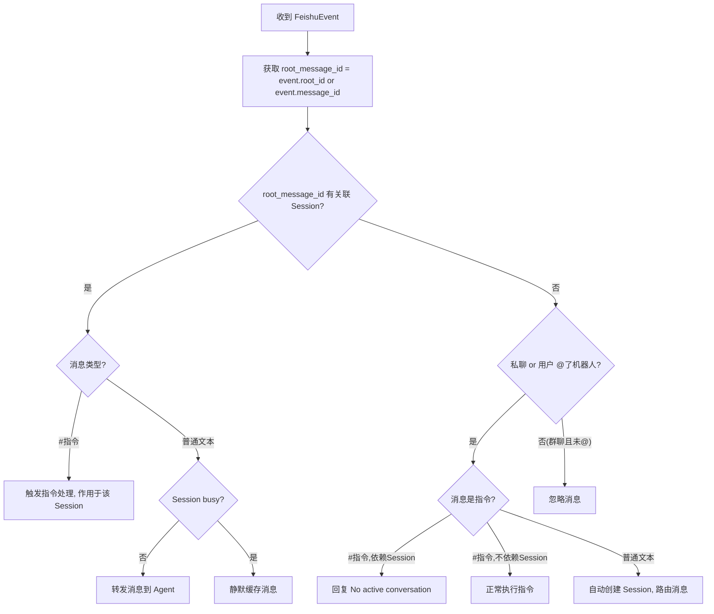

# 技术设计文档：会话管理重构

## 概述

本设计文档描述 AgentBridge 会话管理重构的技术方案。核心变更包括：

1. **自动会话创建**：移除 `#new` / `#agents` 指令，改为 @机器人 自动创建会话
2. **基于消息引用链的会话路由**：通过 `parent_id` 沿引用链向上查找 Root_Message，以 Root_Message 的 `message_id` 作为 Session 索引 key
3. **LRU + TTL 淘汰机制**：限制最大并发会话数，自动清理长时间不活跃的会话
4. **消息缓存与合并发送**：Session busy 时静默缓存消息，处理完成后合并发送
5. **单 agent 配置简化**：`[[agents]]` 数组表改为 `[agent]` 单表
6. **#sessions 指令增强**：显示摘要、状态、最近使用时间
7. **清理 Juan 遗留命名**、**完善 README**

### 设计原则

- 最小化变更范围，保持现有模块划分（handler、session、config、feishu、bridge）
- Session 索引 key 从原来的 `thread_ts`（即 `#new` 消息的 message_id）变为 Root_Message 的 `message_id`
- 飞书 API 新增 reaction 和消息历史查询能力

## 架构

### 架构

模块层级关系重构前后不变：

```
FeishuEvent ← feishu.py
     ↓
handler.py (路由)
     ↓
handler_command.py / handler_message.py
     ↓
session.py (SessionManager)
agent.py (AgentManager → ACP Agent 进程)
```

handler_xxx 子模块根据业务需要同时调用 session.py 和 agent.py，handler.py 只负责路由分发。

重构涉及的模块内部变更：
- `feishu.py`：FeishuEvent 新增 `root_id`、`is_mention_bot`、`sender_name` 字段；新增 `add_reaction()` 方法
- `handler.py`：路由逻辑改为基于 `root_message_id` + 是否有 Session + 是否 @机器人 + 消息类型
- `handler_message.py`：承担原 `#new` 的自动创建 Session 职责；busy 时静默缓存消息
- `handler_command.py`：移除 `#new`/`#agents`；增强 `#sessions`；指令上下文判断适配新路由
- `session.py`：SessionState 新增字段；SessionManager 新增 LRU/TTL 淘汰和消息缓存
- `bridge.py`：启动 TTL 定时检查任务；适配单 agent 配置

### 消息路由流程



### Root_Message 解析流程

需求文档中描述的逻辑是"沿 parent_id 向上查找消息引用链，定位到 Root_Message"，这是业务语义上的正确描述。实现上，飞书消息事件原生包含 `root_id` 字段（即引用链根消息的 ID），因此无需递归 API 调用，直接从事件数据提取即可。

- 若消息有 `root_id`：Root_Message 即为 `root_id` 对应的消息
- 若消息无 `root_id`（独立消息）：Root_Message 即为自身（`message_id`）
- 防御性处理：若异常情况下 `root_id` 为空但 `parent_id` 不为空，使用 `parent_id` 作为 fallback

不同 IM 的处理方式不同（如 Slack 有 `thread_ts`），但都在 IM 层完成解析，handler 层统一使用 `root_message_id`。

## 组件与接口

### 变更文件清单

| 文件 | 变更类型 | 说明 |
|------|---------|------|
| `src/session.py` | 重构 | SessionState 新增字段；SessionManager 增加 LRU/TTL 淘汰、消息缓存 |
| `src/config.py` | 修改 | `[[agents]]` → `[agent]`；新增 `max_sessions`、`session_ttl_minutes` |
| `src/handler.py` | 重构 | 增加 Root_Message 解析和新路由逻辑 |
| `src/handler_command.py` | 修改 | 移除 `#new`/`#agents`；增强 `#sessions`；调整指令上下文判断 |
| `src/handler_message.py` | 修改 | 支持自动创建 Session；busy 时缓存消息而非提示 |
| `src/feishu.py` | 扩展 | FeishuEvent 新增 `root_id`、`is_mention_bot`、`sender_name` 字段；新增 `add_reaction()` 方法 |
| `src/bridge.py` | 修改 | 启动 TTL 定时检查任务；适配单 agent 配置日志 |
| `src/main.py` | 无变更 | - |
| `src/utils.py` | 无变更 | - |

### SessionManager 新接口

```python
class SessionManager:
    # 新增方法
    async def create_session_auto(
        self, root_message_id: str, channel: str, trigger_text: str
    ) -> SessionState:
        """自动创建 Session（使用唯一 agent 配置），触发 LRU 淘汰检查。"""

    async def touch(self, root_message_id: str):
        """更新 Session 的最近使用时间戳。"""

    async def evict_lru(self) -> SessionState | None:
        """淘汰最近最少使用的空闲 Session，返回被淘汰的 Session。"""

    async def evict_ttl_expired(self) -> list[SessionState]:
        """淘汰所有超过 TTL 的 Session，返回被淘汰的 Session 列表。"""

    async def buffer_message(self, root_message_id: str, sender: str, text: str):
        """缓存 busy 状态下收到的消息。"""

    async def flush_buffer(self, root_message_id: str) -> str | None:
        """取出并清空缓存的消息，按时间顺序合并，返回合并后的文本。"""

    def all_busy(self) -> bool:
        """检查是否所有 Session 都处于 busy 状态。"""
```

### FeishuConnection 新接口

```python
class FeishuConnection:
    # 新增方法
    def add_reaction(self, message_id: str, emoji_type: str) -> bool:
        """在消息上添加 reaction 表情。调用 POST /open-apis/im/v1/messages/{message_id}/reactions。"""
```

### handler.py 路由逻辑变更

```python
async def handle_event(event, feishu, config, agent_manager, session_manager, ...):
    # 1. Root_Message ID 直接从 FeishuEvent 获取（飞书原生支持 root_id）
    root_message_id = event.root_id or event.message_id

    # 2. 查找关联 Session
    session = await session_manager.get_session(root_message_id)

    # 3. 根据 session 存在与否 + 消息类型 + 是否 @机器人 进行路由
    # （详见消息路由流程图）
```

## 数据模型

### SessionState 变更

```python
@dataclass
class SessionState:
    session_id: str               # ACP agent 返回的会话 ID
    channel: str                  # chat_id，发消息回飞书时需要
    busy: bool = False
    trigger_message_id: str = ""  # Trigger_Message 的 message_id
    config_options: Optional[list] = None
    modes: Optional[dict] = None
    models: Optional[dict] = None
    # ---- 新增字段 ----
    summary: str = ""             # Trigger_Message 文本前 20 个字符
    last_active: float = 0.0      # 最近使用时间戳 (time.time())
    last_bot_message_id: str = "" # 最后一条机器人回复的 message_id（用于淘汰时添加 reaction）
    message_buffer: list[tuple[float, str, str]] = field(default_factory=list)
    # message_buffer 元素: (timestamp, sender_name, text)
```

移除的字段：
- `agent_name`：单 agent 模式，直接从 `config.agent` 读取
- `workspace`：不再支持每 session 不同 workspace，直接从 `config.bridge.default_workspace` 读取
- `auto_approve`：单 agent 模式，直接从 `config.agent.auto_approve` 读取
- `initial_ts`：重命名为 `trigger_message_id`

### Config 变更

```python
@dataclass
class BridgeConfig:
    default_workspace: str = "~"
    auto_approve: bool = False
    allowed_users: list[str] = field(default_factory=list)
    # ---- 新增字段 ----
    max_sessions: int = 10
    session_ttl_minutes: int = 60

@dataclass
class Config:
    feishu: FeishuConfig
    bridge: BridgeConfig
    agent: AgentConfig          # 从 agents: list[AgentConfig] 改为单个 agent
```

### 配置文件格式变更

**旧格式 (bridge.toml)**:
```toml
[feishu]
app_id = "..."
app_secret = "..."

[bridge]
default_workspace = "~"
auto_approve = false

[[agents]]
name = "kiro"
description = "Kiro CLI"
command = "kiro-cli"
args = ["acp"]
```

**新格式 (bridge.toml)**:
```toml
[feishu]
app_id = "..."
app_secret = "..."

[bridge]
default_workspace = "~"
auto_approve = false
max_sessions = 10
session_ttl_minutes = 60

[agent]
name = "kiro"
description = "Kiro CLI - https://kiro.dev/cli/"
command = "kiro-cli"
args = ["acp"]
auto_approve = false
```

### SessionManager 内部数据结构

```python
class SessionManager:
    _sessions: dict[str, SessionState]       # root_message_id → SessionState
    _config: Config
    _lock: asyncio.Lock
```

### LRU 淘汰实现

不引入额外依赖，使用 Python 标准库 `collections.OrderedDict` 替代普通 `dict` 存储 `_sessions`。每次 `touch()` 时将对应 key 移到末尾（`move_to_end`），淘汰时从头部取最久未使用的空闲 Session。

### TTL 淘汰实现

在 `bridge.py` 的主事件循环中启动一个 `asyncio.create_task` 定时任务，每 60 秒调用 `session_manager.evict_ttl_expired()`，遍历所有 Session 检查 `time.time() - session.last_active > ttl_seconds`。

### 消息缓存与合并发送

- Session busy 时，`handler_message.py` 调用 `session_manager.buffer_message()` 将消息存入 `SessionState.message_buffer`
- Agent 处理完成后（`_do_prompt` 的 finally 块），调用 `session_manager.flush_buffer()` 获取合并文本
- 合并格式：按时间顺序，每条消息格式为 `[sender]: text`，多条消息用换行分隔
- 合并后的文本作为一条新的 prompt 发送给 Agent
- `flush_buffer` 取出后即清空 `message_buffer`，避免重复发送

### 飞书 API 新增调用

1. **添加 Reaction**: `POST /open-apis/im/v1/messages/{message_id}/reactions` — 淘汰 Session 时在 Trigger_Message 和最后一条机器人回复上添加 DONE 表情

注：Root_Message 解析不需要额外 API 调用，飞书消息事件原生包含 `root_id` 字段。

### FeishuEvent 扩展

```python
@dataclass
class FeishuEvent:
    chat_id: str
    message_id: str
    parent_id: Optional[str]
    text: str
    files: list[FeishuFile] = field(default_factory=list)
    # ---- 新增字段 ----
    root_id: Optional[str] = None  # 飞书原生提供的消息引用链根消息 ID
    is_mention_bot: bool = False   # 消息是否 @了机器人
    sender_name: str = ""          # 发送者名称（用于消息缓存合并时标注）
    chat_type: str = ""            # 聊天类型：p2p（私聊）或 group（群聊）
```

在 `FeishuConnection._on_message_receive()` 中从事件数据提取 `root_id`、`mentions` 和 `sender` 信息。handler 层通过 `event.root_id or event.message_id` 获取 Root_Message ID，无需额外 API 调用。


## 正确性属性（Correctness Properties）

*正确性属性是指在系统所有合法执行中都应成立的特征或行为——本质上是对系统应做什么的形式化陈述。属性是人类可读规格说明与机器可验证正确性保证之间的桥梁。*

### Property 1: 自动创建 Session 以 Root_Message 为索引

*For any* 消息，若该消息满足以下条件之一：(a) 在群聊中 @了机器人，或 (b) 在私聊中发送，且不是指令（不以 # 或 ! 开头）、且其 Root_Message 没有关联的活跃 Session，则 SessionManager 应创建一个新 Session，其索引 key 等于 Root_Message 的 message_id，且 Session 使用配置文件中唯一 agent 的设置。

**Validates: Requirements 1.1, 1.5, 2.3**

### Property 2: 消息路由到已有 Session

*For any* 消息，若其 Root_Message 已关联一个活跃 Session，则该消息应被路由到该 Session（无论是否再次 @机器人），且不应创建新的 Session。

**Validates: Requirements 1.2, 1.8, 2.2**

### Property 3: 忽略无关消息

*For any* 消息，若该消息来自群聊、未 @机器人、不是指令、且其 Root_Message 没有关联的活跃 Session，则该消息应被忽略（不创建 Session、不发送任何回复）。

**Validates: Requirements 1.9, 2.4**

### Property 4: Session 内指令无需 @机器人

*For any* # 指令消息，若该消息位于已有 Session 的消息引用链中，则无论是否 @了机器人，该指令都应被处理并作用于该 Session。

**Validates: Requirements 1.10**

### Property 5: Session 外指令需要 @机器人（群聊）或直接发送（私聊）

*For any* # 指令消息，若该消息不在任何已有 Session 的消息引用链中，则在群聊中仅当用户 @了机器人时才触发指令处理，在私聊中无需 @机器人即可触发；对于依赖 Session 的指令应回复 "No active conversation"，对于不依赖 Session 的指令应正常执行。

**Validates: Requirements 1.11**

### Property 6: Root_Message ID 提取的正确性

*For any* FeishuEvent，若事件包含 `root_id` 字段，则 Root_Message ID 应等于 `root_id`；若事件不包含 `root_id`（独立消息），则 Root_Message ID 应等于 `message_id`。

**Validates: Requirements 2.1**

### Property 7: Session 摘要为触发消息前 20 字符

*For any* 触发消息文本，自动创建的 Session 的 summary 字段应等于该文本的前 20 个字符（若文本不足 20 字符则取全部）。

**Validates: Requirements 1.6**

### Property 8: 消息缓存按时间顺序合并并保留发送者

*For any* 一组在 Session busy 期间到达的消息序列，`flush_buffer` 返回的合并文本应按消息到达时间升序排列，且每条消息的发送者信息都出现在合并结果中。

**Validates: Requirements 2.6, 2.7**

### Property 9: LRU 淘汰选择最久未使用的空闲 Session

*For any* 一组活跃 Session（数量已达 max_sessions），当需要淘汰时，被淘汰的 Session 应是所有非 busy Session 中 `last_active` 最小的那个。

**Validates: Requirements 3.2**

### Property 10: Touch 更新最近使用时间戳

*For any* Session，调用 `touch()` 后其 `last_active` 应大于等于调用前的值，且应反映当前时间。

**Validates: Requirements 3.3**

### Property 11: TTL 淘汰移除超时 Session

*For any* 一组活跃 Session 和给定的 `session_ttl_minutes` 值，`evict_ttl_expired` 应淘汰且仅淘汰那些 `time.time() - last_active > ttl_seconds` 的 Session。

**Validates: Requirements 4.3**

### Property 12: 淘汰时终止进程并添加 Reaction

*For any* 被淘汰的 Session（无论 LRU 还是 TTL），系统应终止对应的 ACP_Agent 进程，并在该 Session 的 Trigger_Message 和最后一条机器人回复消息上添加 reaction 表情。

**Validates: Requirements 3.5, 3.6, 4.4, 4.5**

### Property 13: 配置缺省值

*For any* 配置文件，若缺少 `max_sessions` 字段则默认值为 10，若缺少 `session_ttl_minutes` 字段则默认值为 60。

**Validates: Requirements 5.5**

### Property 14: #sessions 输出格式

*For any* 一组活跃 Session，执行 `#sessions` 指令的输出应包含每个 Session 的摘要（summary）、状态（busy/idle）和最近使用时间，且不包含 agent 名称。

**Validates: Requirements 6.1, 6.2**

## 错误处理

| 场景 | 处理方式 |
|------|---------|
| ACP_Agent 启动失败 | 向用户回复错误信息，不创建 Session（需求 1.7） |
| 所有 Session 均 busy 且达上限 | 回复 "All sessions are busy, please try again later"（需求 3.4） |
| 飞书 API 调用失败（add_reaction） | 记录日志，不影响淘汰流程 |
| 配置文件缺少 [agent] 表 | 启动时校验失败，抛出异常退出 |
| 配置文件包含多个 agent 配置 | 启动时校验失败，抛出异常退出 |

## 测试策略

### 双重测试方法

本项目采用单元测试 + 属性测试（Property-Based Testing）的双重策略：

- **单元测试**：验证具体示例、边界情况和错误条件
- **属性测试**：验证跨所有输入的通用属性

两者互补：单元测试捕获具体 bug，属性测试验证通用正确性。

### 属性测试库

使用 **Hypothesis**（Python 属性测试库），已是 Python 生态中最成熟的 PBT 框架。

需在 `pyproject.toml` 的 `[dependency-groups] dev` 中添加：
```toml
dev = [
    "pytest>=9.0.2",
    "pytest-asyncio>=1.3.0",
    "hypothesis>=6.100.0",
]
```

### 属性测试配置

- 每个属性测试至少运行 **100 次迭代**（`@settings(max_examples=100)`）
- 每个属性测试必须用注释标注对应的设计属性
- 标注格式：`# Feature: session-refactor, Property {number}: {property_text}`

### 单元测试覆盖

单元测试重点覆盖：
- `#new` / `#agents` 指令已移除（需求 1.3, 1.4）
- 配置文件解析：`[agent]` 单表、默认值、校验（需求 5.1-5.4）
- `init` 命令生成的样例配置格式（需求 5.3）
- ACP_Agent 启动失败时的错误处理（需求 1.7）
- 所有 Session busy 时的提示（需求 3.4）
- Juan 命名清理验证（需求 7.2, 7.3）
- README 内容检查（需求 8.1-8.5）

### 属性测试覆盖

每个 Correctness Property（Property 1-14）对应一个属性测试：

| Property | 测试文件 | 核心生成器 |
|----------|---------|-----------|
| P1: 自动创建 Session | `tests/test_session.py` | 随机消息（mention=True, non-command text, no existing session） |
| P2: 路由到已有 Session | `tests/test_session.py` | 随机消息 + 已有 session 的 root_message_id |
| P3: 忽略无关消息 | `tests/test_handler.py` | 随机消息（mention=False, no session） |
| P4: Session 内指令无需 @mention | `tests/test_handler.py` | 随机 # 指令 + 已有 session |
| P5: Session 外指令需要 @mention | `tests/test_handler.py` | 随机 # 指令 + 无 session |
| P6: Root_Message ID 提取 | `tests/test_feishu.py` | 随机 FeishuEvent（有/无 root_id） |
| P7: 摘要截断 | `tests/test_session.py` | 随机 Unicode 字符串 |
| P8: 消息缓存合并 | `tests/test_session.py` | 随机消息列表（含 sender 和 timestamp） |
| P9: LRU 淘汰 | `tests/test_session.py` | 随机 Session 集合（不同 last_active, busy 状态） |
| P10: Touch 时间戳 | `tests/test_session.py` | 随机 Session |
| P11: TTL 淘汰 | `tests/test_session.py` | 随机 Session 集合 + 随机 TTL 值 |
| P12: 淘汰清理 | `tests/test_session.py` | 随机被淘汰 Session |
| P13: 配置缺省值 | `tests/test_config.py` | 随机配置字典（随机缺少字段） |
| P14: #sessions 输出 | `tests/test_handler_command.py` | 随机 Session 集合 |

每个属性测试必须由单个 property-based test 实现，使用 Hypothesis 的 `@given` 装饰器。
